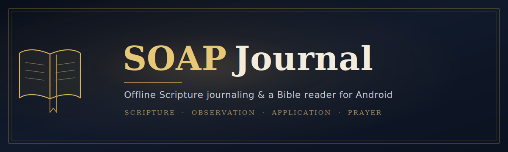
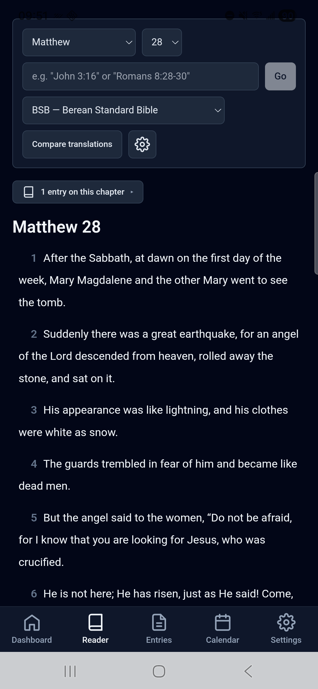
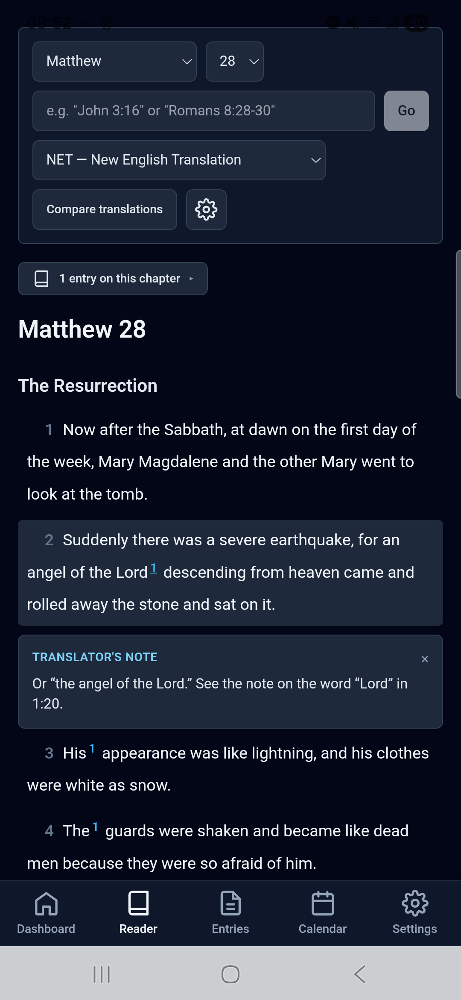
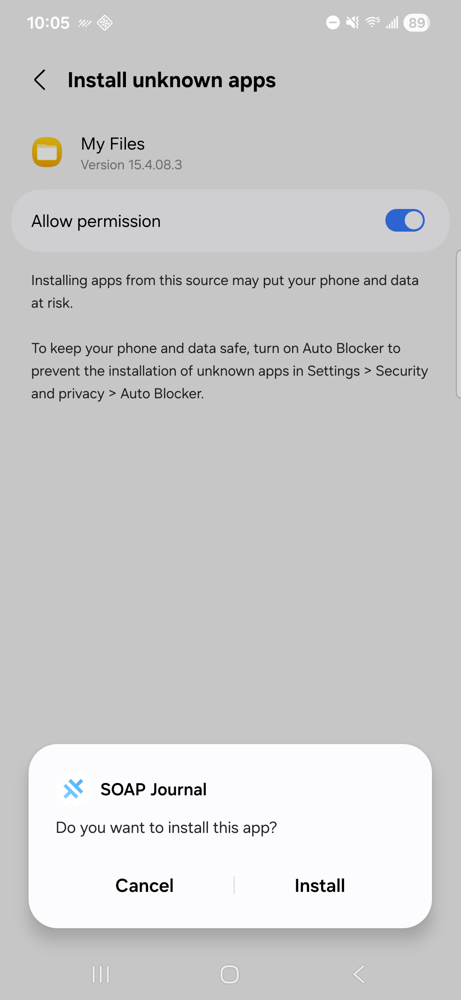
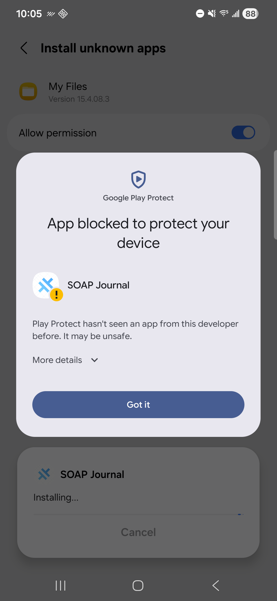
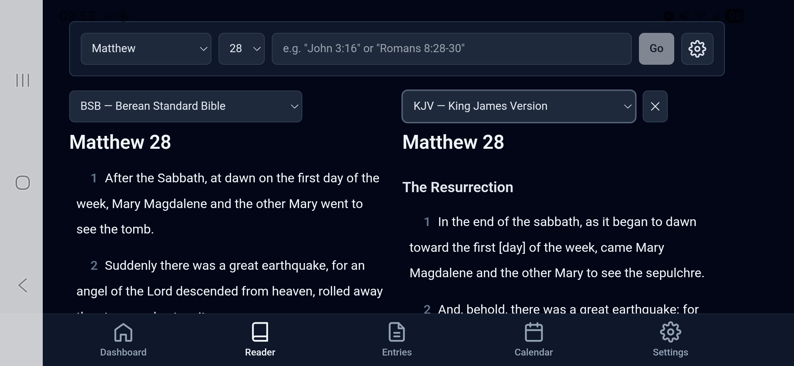
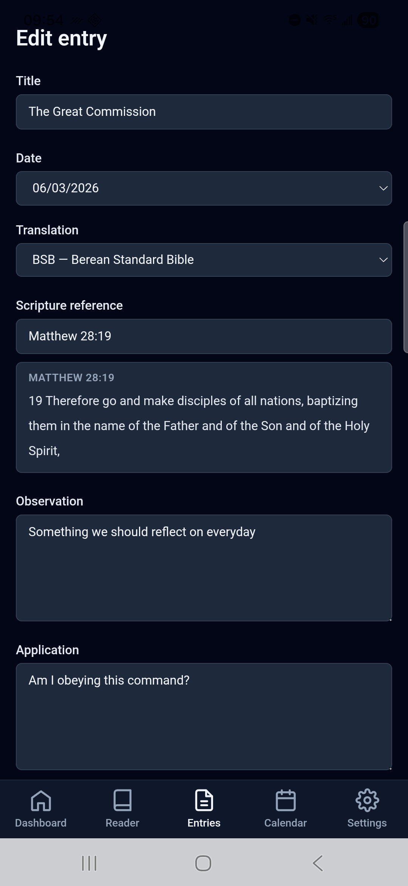

# SOAP Journal

A warm, distraction-free way to **read the Bible and journal through it** on your Android
phone — completely offline. Read in any of **13 built-in translations**, compare two
side by side, and capture what you're learning with the time-tested **SOAP** method
(Scripture · Observation · Application · Prayer).


📱 **Android only** — no iPhone/iPad version ([why](#ios)).

| Reading | A translator's note |
| --- | --- |
|  |  |

👉 **[Install on Android](#install-on-android)** — download, allow the install, open. That's it.

**Contents:** [Is this for you?](#is-this-for-you) · [Install on Android](#install-on-android) · [Using SOAP Journal](#using-soap-journal) · [Add your own translations](#add-your-own-translations-esv-nlt-nkjv-net) · [Backup & restore](#backup--restore) · [Build from source](#build-from-source-for-developers) · [The 13 translations](#the-13-built-in-translations)

---

## Is this for you?

Most people only need the first line. The honest breakdown, so nothing surprises you:

- **Just want to read and journal? This is easy.** Download one file, tap to install,
  open it. **All 13 translations are already inside** — there's nothing else to set up,
  and no account to create. Start here → [Install on Android](#install-on-android).
- **Want to add a copyrighted translation you own (ESV, NLT, NKJV, NET…)? This takes more
  effort.** It needs a computer, a little comfort with the command line, and your own
  legally-obtained copy of that translation. It's optional and you can do it later →
  [Add your own translations](#add-your-own-translations-esv-nlt-nkjv-net).
- **A developer who wants to build it yourself?** Everything you need is at the bottom →
  [Build from source](#build-from-source-for-developers).

This README won't pretend the second and third paths are one-tap — they aren't. But the
first one really is.

---

## Features

- **A real Bible reader.** 13 translations built in; jump to any passage (`John 3:16`,
  `Romans 8:28-30`) or use the book/chapter pickers. Adjustable text size, verse or
  paragraph layout, light/dark.
- **Compare two translations** side by side — each pane has its own picker (best in landscape).
- **SOAP journaling.** Tap a verse and the Scripture + reference are pre-filled; add your
  Observation, Application, Prayer, and tags.
- **Find your way back.** Search and filter **your journal** by word, book, tag, or date; a
  **calendar** of the days you wrote; **"on this day in previous years";** and an
  entries-on-this-chapter badge in the reader.
- **Optional translator's notes** (NET Bible): inline, tappable footnote markers with
  **cross-references that jump to the passage**.
- **Bring your own translations** — import any you have the right to use, from Settings.
- **Back up and restore your journal** to a file you control.
- **Private by default.** Fully offline — no account, no cloud, no tracking; your journal
  stays on your phone.

> A quick, honest note on what's **not** here (yet): there's no full-text search of the
> Bible itself (you navigate by reference), no verse highlighting, no multi-device sync,
> and no iPhone version. See [iOS](#ios) below.

---

## Install on Android

The app is distributed as a single downloadable file (an **APK**) rather than through the
Google Play Store, so installing it takes a couple of extra taps the first time. That's
normal for apps shared this way — here's exactly what to expect.

1. **Download the app.** On your phone, open the
   [**Releases page**](https://github.com/kbennett2000/soap-journal-mobile/releases) and
   download **`app-release.apk`** from the latest release. It's a **larger download
   (~80 MB)** because all 13 translations are bundled inside — that's why it works fully
   offline.
2. **Open the file** (from your notification shade or the Files app's Downloads).
3. **Allow installs from this source.** Android will ask whether to let your browser/Files
   app install apps — this prompt appears because the app isn't from the Play Store, not
   because anything is wrong. Tap **Settings → allow from this source**, then back out.
   
4. **"Unrecognized app" / Play Protect.** Android may warn that it doesn't recognize the
   developer. This is expected for **any** app installed outside the Play Store. Tap
   **More details → Install anyway** to continue.
   
5. **Open it.** The reader already has all 13 translations loaded. That's it — you're
   reading.

---

## Using SOAP Journal

A two-minute tour:

- **Read.** The **Reader** tab opens your last place. Use the book/chapter pickers or the
  jump bar; adjust text size and verse/paragraph layout from the settings (gear) button.
- **Compare.** Tap **Compare translations**, then turn your phone to landscape to see two
  translations side by side. Each side has its own picker.
  

  > 💡 **Compare reads best in landscape** — turn your phone sideways and the two
  > translations sit side by side. Upright, they stack one above the other.
- **Journal a verse.** Tap any verse to start a SOAP entry with the reference and text
  pre-filled; add your Observation, Application, Prayer, and tags.
  
- **Look back.** The **Entries** tab lists and filters everything you've written; the
  **Calendar** tab shows the days you journaled; the **Dashboard** surfaces recent entries
  and "on this day in previous years."
- **Make it yours.** The **Settings** tab has the light/dark theme, translation import, and
  backup & restore.

---

<details>
<summary><strong>Add your own translations (ESV, NLT, NKJV, NET)</strong> — optional / advanced; click to expand</summary>

## Add your own translations (ESV, NLT, NKJV, NET)

**Optional and more advanced.** The 13 built-in translations are public-domain or freely
licensed, so they can ship with the app. Translations like **ESV, NLT, NKJV, and NET are
copyrighted** — their text is *not* included, and never will be. If you own a copy you're
legally entitled to use, you can add it yourself.

There are two parts: **building** a translation file (on a computer) and **importing** it
(on your phone).

**1. Build the translation file (on a computer).** The translation-building tool lives in
the companion project, [**soap-journal**](https://github.com/kbennett2000/soap-journal) —
see its translation/admin docs (e.g. `docs/usage/08-admin-tasks.md`). In short: it runs on
a computer and produces one `.json` file per translation from a source you supply. (This
README won't duplicate those steps — follow the tool's own docs.)

**2. Import it on your phone.**

1. Transfer the `.json` file to your phone (USB, cloud drive, or email) — the **Downloads**
   folder is a fine place to put it.
2. In the app, go to **Settings → Translations → Import**.
3. Pick the file. The app checks it, then loads it; re-importing the same translation simply
   replaces it.

Once imported, it appears in the reader and the compare picker like any other translation.
The **NET Bible** additionally carries inline translator's notes with tappable
cross-references.

</details>

---

## The soap-journal project

SOAP Journal (this app) is the **offline, single-user Android companion** to
[**soap-journal**](https://github.com/kbennett2000/soap-journal) — the full, self-hosted
version you run on your own server for your household (a web app with multiple private
journals, managed by an admin, on your home network). The two are separate by design and
don't sync.

The tool for **building your own translation files** lives in that project; this app
**reads** the files it produces.

---

## iOS

There's no iPhone or iPad version, and likely won't be. Building for iOS requires a Mac
(which this project doesn't have), but that's only the start: unlike Android, iOS has no
simple sideload path, so publishing to others means a paid Apple Developer account
(~$99/year) and App Store review. For a free, offline hobby project, that cost and overhead
don't make sense. Contributions from someone already set up for iOS are welcome.

---

## Backup & restore

Your journal lives only on your phone, so keep a backup — especially before reinstalling or
switching devices.

- **Export:** Settings → **Backup & Restore → Export backup** saves your entries and tags to
  a JSON file you can store anywhere (it does **not** include Bible text — translations are
  re-added separately).
- **Restore:** **Restore from backup** reads that file back. It **replaces** your current
  journal with the backup's contents (you'll be asked to confirm first).

To move to a new phone: export on the old device, install the app on the new one, then
restore. Details in [docs/backup-and-restore.md](docs/backup-and-restore.md).

---

<details>
<summary><strong>Build from source (for developers)</strong> — click to expand</summary>

## Build from source (for developers)

The app is a Capacitor-wrapped React + TypeScript SPA over a local SQLite database. It ships
a **prebuilt Bible asset** (a SQLite DB with the 13 translations) that is generated
out-of-band and copied into place on first launch.

### Building the prebuilt Bible asset

The prebuilt SQLite database (Bible text populated, journal tables empty) is **not**
committed — it's a build artifact:

1. Generate the 13 public-domain canonical JSONs with the companion repo's
   `build-translation` command (one `.json` per translation).
2. Drop them in `bibles-canonical/` (gitignored).
3. Run `npm run build-bible-db` — validates each file against the canonical schema and emits
   `public/assets/databases/soapjournal.db` (a malformed file fails loudly and writes
   nothing).
4. `npm run build` then `npx cap sync android` carry the asset into the Android project
   (`public/` → `dist/` → Android assets). The app opens it as
   `createConnection("soapjournal")`.

`bibles-canonical/` (inputs) and `public/assets/databases/` (the asset) are both gitignored.
This step is an operational task, not part of the test suite (it needs the real translation
JSONs).

### Building the Android app

The native Android build (Capacitor 8) **requires JDK 21** — Gradle fails with `invalid
source release: 21` on JDK 17. The Android SDK must also be available (`ANDROID_HOME` or
`android/local.properties` → `sdk.dir`).

Point Gradle at a JDK 21 once, so you never have to export `JAVA_HOME` per build, by adding
it to your **user-global** `~/.gradle/gradle.properties` (never committed):

```properties
org.gradle.java.home=/absolute/path/to/jdk-21
```

(`android/gradle.properties` is committed by Capacitor and holds shared build flags, so a
machine-specific JDK path belongs in `~/.gradle/gradle.properties`, not there. Exporting
`JAVA_HOME=/path/to/jdk-21` per shell also works.) No JDK 21 installed? A portable Temurin 21
tarball extracted anywhere works — point `org.gradle.java.home` at it.

Then, with the prebuilt asset in place (above):

```bash
npm run build && npx cap sync android      # carry web + DB asset into the native project
npx cap run android                         # build, install, launch on a connected device
```

### Building a release APK

A signed, **universal** release APK (all CPU architectures in one file — users never pick an
architecture; the ~75 MB Bible asset is bundled inside) for public sideloading.

Prerequisites: JDK 21 (above), and carry the latest web build + DB asset into the native
project first:

```bash
npm run build && npx cap sync android
cd android && ./gradlew assembleRelease
# signed →   android/app/build/outputs/apk/release/app-release.apk
# (without keystore.properties → app-release-unsigned.apk; the build still succeeds)
```

Signing is driven by **`android/keystore.properties`** (gitignored — never committed). Create
it once with your keystore's details:

```properties
storeFile=/absolute/or/android-relative/path/to/soapjournal-release.keystore
storePassword=…
keyAlias=…
keyPassword=…
```

When this file is absent (contributors, CI, debug builds), the release signing step is
skipped and `assembleRelease` produces an *unsigned* APK rather than failing — and
`npx cap run android` (debug) is unaffected.

**The keystore is yours to generate and guard — it is not scripted, and never touches git.**
Make it once with `keytool`:

```bash
keytool -genkeypair -v -keystore soapjournal-release.keystore -alias soapjournal \
  -keyalg RSA -keysize 2048 -validity 10000
```

**Back the keystore up.** If you lose it you can never ship an in-place update again —
Android refuses to install an APK signed by a different key over an existing one, so every
user would have to uninstall and reinstall (losing local data). Keep
`soapjournal-release.keystore` and `keystore.properties` off git and in safe storage.

### Verify the signature before uploading (required)

After `assembleRelease`, verify the APK carries **both** signature schemes before you upload
it (`apksigner` ships in the Android SDK under `build-tools/<version>/`):

```bash
apksigner verify --verbose android/app/build/outputs/apk/release/app-release.apk
```

Confirm the output shows **both**:

```
Verified using v1 scheme (JAR signing): true
Verified using v2 scheme (APK Signature Scheme v2): true
```

**Why this matters:** a **v2-only** APK installs fine via `adb install` but fails
**tap-to-install on some devices (notably Samsung)** with *"App not installed."* Because
`minSdkVersion` is 24, the Android Gradle Plugin would otherwise drop the legacy v1 signature;
the release `signingConfig` now sets `enableV1Signing true` + `enableV2Signing true` to force
both. Run this check every release so a signing regression never ships.

### Versioning each release

The app version lives in [`android/app/build.gradle`](android/app/build.gradle)
(`defaultConfig` → `versionCode` / `versionName`). For **every** release, **bump
`versionCode`** (1 → 2 → 3 …) and set `versionName` to the new SemVer (e.g. `"1.1.0"`), add a
matching entry to [`CHANGELOG.md`](CHANGELOG.md), and sign with the **same keystore** as
before. A non-increasing `versionCode` makes Android **reject** the new APK as an in-place
update — so this bump is not optional. Then run the
[signature check](#verify-the-signature-before-uploading-required) (v1 **and** v2 true) before
uploading.

More design detail lives in [`docs/`](docs/) (architecture, schema, first-run & import,
backup & restore).

</details>

---

## The 13 built-in translations

Twelve are public domain; **BSB** is freely licensed (a public-domain-style dedication).

<details>
<summary>Show all 13</summary>

| Code | Translation |
| --- | --- |
| **BSB** | Berean Standard Bible *(default)* |
| KJV | King James Version |
| AKJV | American King James Version |
| ASV | American Standard Version (1901) |
| CPDV | Catholic Public Domain Version |
| DBT | Darby Bible Translation (1890) |
| DRB | Douay-Rheims Bible (Challoner) |
| ERV | English Revised Version (1885) |
| JPS | JPS Tanakh / Weymouth NT (1917 JPS Tanakh OT + 1903 Weymouth NT) |
| SLT | Smith's Literal Translation (1876) |
| WBT | Webster's Bible Translation (1833) |
| WEB | World English Bible |
| YLT | Young's Literal Translation (1898) |

</details>

---

## License

[MIT](LICENSE).

## Contributing

Issues and pull requests are welcome. The codebase is React + TypeScript with a headless
test suite (`npm test`); please keep it green and match the existing conventions in
[`CLAUDE.md`](CLAUDE.md). See [`CHANGELOG.md`](CHANGELOG.md) for release history.
